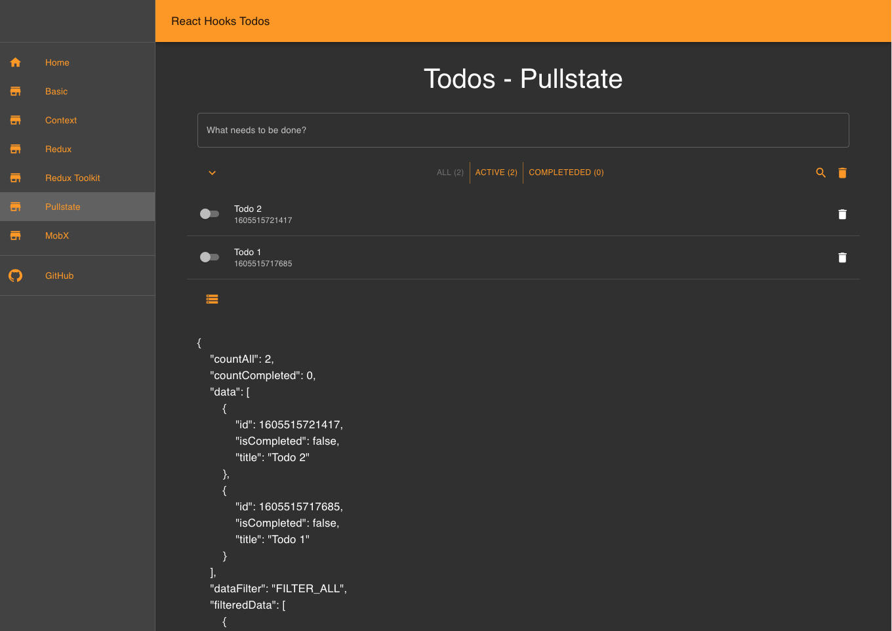

# React-Hooks-State-Management-Alternatives...

A classic React TypeScript Todo App with alternative state management side by side.

## Purpose:

For education and demonstrations to easily show alternative solutions for managing states, from component prop drilldown to global stores.

## Note:

Lorum ipsum @TODO Since different solutions live side by side in this App, there is a structure that is not optimized for production in all parts e.g. Typescript Types, duplicate code etc.

## Alternatives:

- [Basic React Hooks](https://reactjs.org/docs/hooks-intro.html), State and Effect
- [React Context](https://reactjs.org/docs/context.html) and
  [React Reducer](https://reactjs.org/docs/hooks-reference.html#usereducer)
- [Redux State Container](https://redux.js.org/)
- [MobX State management](https://mobx.js.org/README.html), [MobX-lite](https://github.com/mobxjs/mobx-react-lite) and [MobX-state-Tree ](https://github.com/mobxjs/mobx-state-tree)

## Commands

The App is based on [create-react-app](https://github.com/facebook/create-react-app)

### `npm start` or `yarn start`

Runs the app in development mode. 
Open [http://localhost:3000](http://localhost:3000) to view it in the browser.

### `npm test` or `yarn test`

Runs Jest Tests
